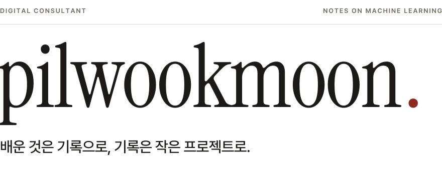
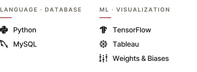
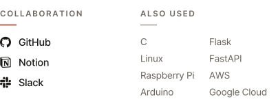

<a name="top" href="https://github.com/pilwookmoon"><picture><source media="(prefers-color-scheme: dark)" srcset="assets/masthead-dark.svg"></picture></a>

**디지털 컨설턴트**로 일하며, 
개인적인 관심으로 
**머신러닝과 딥러닝**을 공부하고 있습니다.

 

## [<picture><source media="(prefers-color-scheme: dark)" srcset="assets/h-01-dark.svg"></picture>](#toolkit)

  <picture><source media="(prefers-color-scheme: dark)" srcset="assets/stack-a-dark.svg"></picture>
  <picture><source media="(prefers-color-scheme: dark)" srcset="assets/stack-b-dark.svg"></picture>

 

## [<picture><source media="(prefers-color-scheme: dark)" srcset="assets/h-02-dark.svg"></picture>](#archive)

그동안의 작업과 자세한 소개는 노션에, 
공부하며 남긴 노트와 실습 코드는 
이곳 저장소에 정리해 두었습니다.

<!--
  대표 프로젝트를 넣는 방법
  1) build/projects.js에 프로젝트를 적습니다.
  2) build 폴더에서 `node build.js`를 실행합니다. (처음 한 번은 `npm install`을 먼저 실행하세요.)
  그러면 바로 아래 projects:start와 projects:end 사이에 카드가 자동으로 들어갑니다.
  자세한 방법은 build/README.md에 있습니다.

  빌드 없이 직접 적으려면 아래 형식을 projects:end 줄 바로 아래(이 주석 밖)에 붙여 넣으세요.
  - 프로젝트가 여러 개면 항목 사이에 빈 줄을 하나씩 둡니다. 빈 줄이 없으면 두 항목이 한 줄로 붙어 버립니다.
  - 두 표시 사이는 빌드할 때마다 새로 채워지므로, 손으로 쓴 내용은 반드시 그 바깥에 둡니다.
  - 이 방식에서는 링크가 GitHub 기본 파란색으로 보입니다.

**[첫 번째 프로젝트](https://github.com/pilwookmoon/REPO)** — 한 줄 설명 
Python · TensorFlow

**[두 번째 프로젝트](https://github.com/pilwookmoon/REPO)** — 한 줄 설명 
Python · MySQL
-->
<!-- projects:start -->
<!-- projects:end -->

[<picture><source media="(prefers-color-scheme: dark)" srcset="assets/btn-portfolio-dark.svg"></picture>](https://scandalous-freedom-a2d.notion.site/Data-Engineer-db8e524ad9144bbcbcd8010d5b471873?pvs=4) [<picture><source media="(prefers-color-scheme: dark)" srcset="assets/btn-repos-dark.svg"></picture>](https://github.com/pilwookmoon?tab=repositories)

 

[<picture><source media="(prefers-color-scheme: dark)" srcset="assets/end-dark.svg"></picture>](#top)
